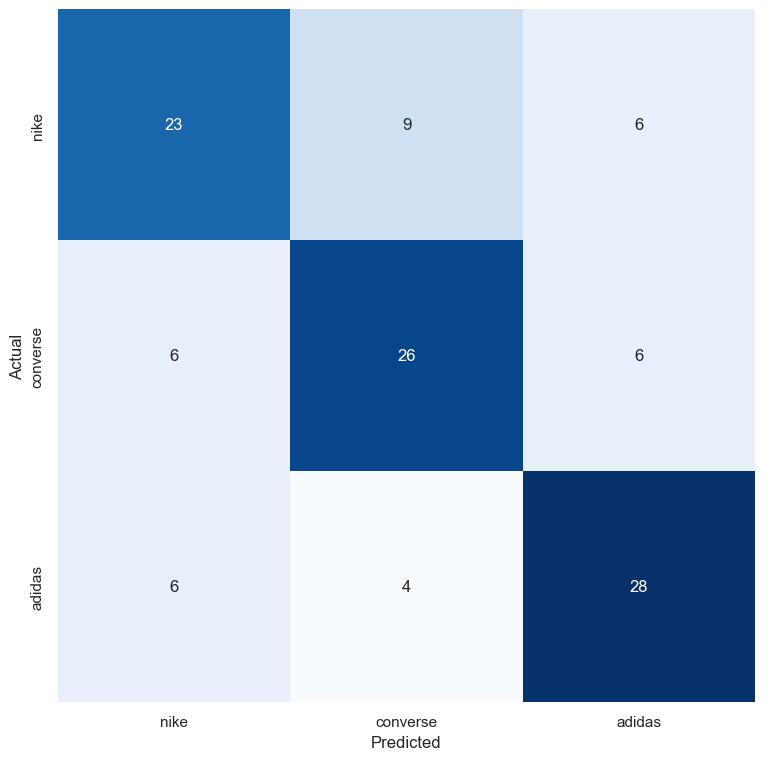
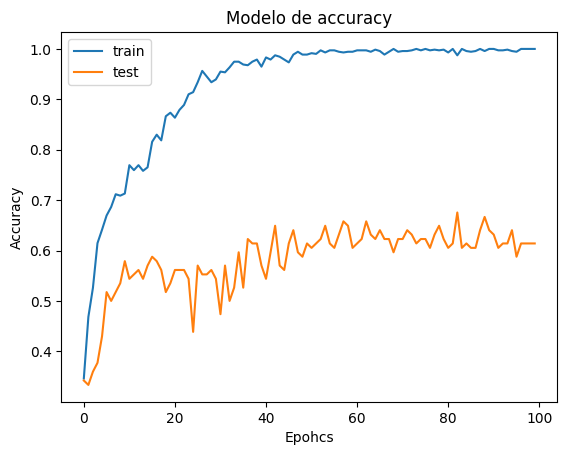
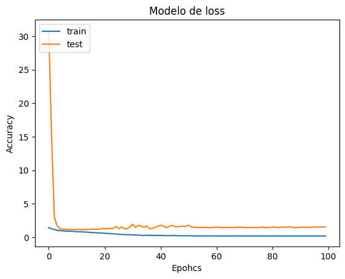
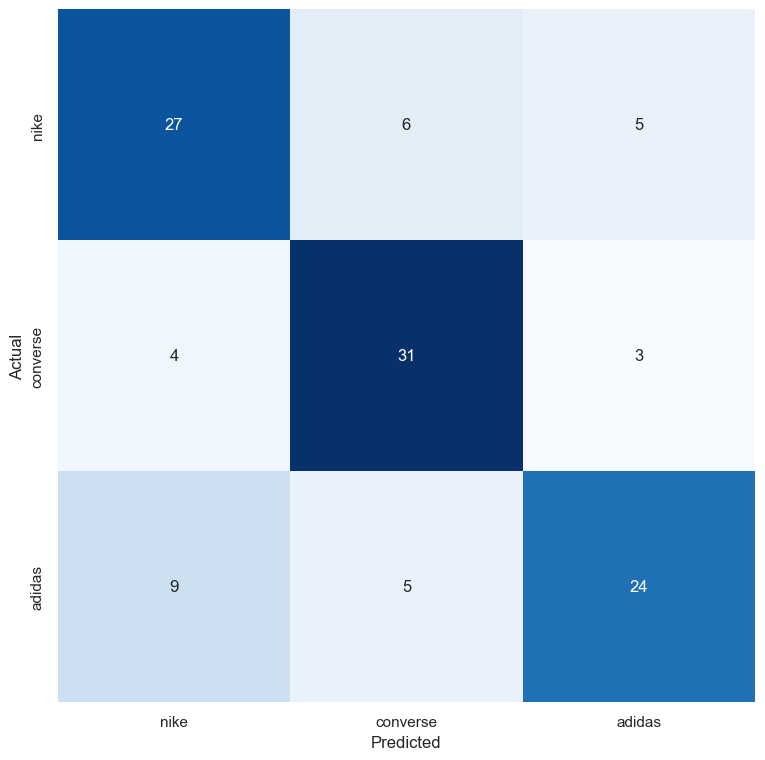
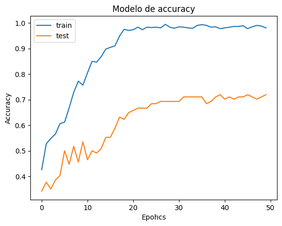
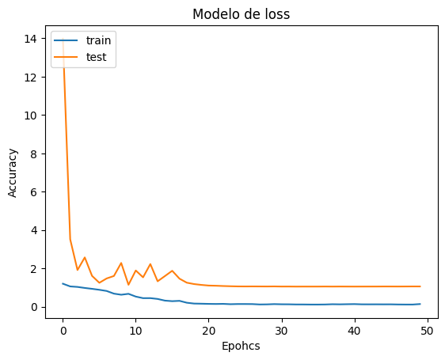

# Classifiers with attention modules


In this projects we are going to see different methods to use attention modules on modern
Deep learning models for classification. Let's see a little bit about it.
We're gonna take as a base model the ResNet50 and the dataset, Nike-Adidas-Converse Image
classification from kaggle, we'll train and test using differents models. Finally, we'll use
different methods to compare the results.


⭐ ResNet 50

⭐ ResNet 50 + SE attention mdule

⭐ ResNet 50 + CBAM attention module

⭐ We're going to compare our result with differente metrics: Accuracy Curve, Loss Curve, Confusion Matrix y GradCam.

⭐  We're going to use the best model found, and then we'll add more date to the training set using GAN's model and then we'll use the comparative metrics on the before step.

----------

# How to run this repo
Download the .ipynb put it into a folder with your train and test folder from the tennis dataset. Upload it to your colab/jupyter enviroment and setup your paths for the folders/files that are going to be automaticly created for the differentes weights en metrics. 

Now let's see some code of the project and the summary of
the metrics worked.

- `aug_smooth=True`


# Using GradCAM from Deep Learning with Python

```python
#Algortimo de GradCAM para visualizacion
#Author: fchollet
#Libro: Deep Learning with Python (2017)
#Description: How to obtain a class activation heatmap for an image classification model.
def get_img_array(img_path, size):
  # `img` is a PIL image of size 299x299
  img =keras.preprocessing.image.load_img(img_path, target_size=size)
  # `array` is a float32 Numpy array of shape (299, 299, 3)
  array = keras.preprocessing.image.img_to_array(img)
  # We add a dimension to transform our array into a "batch"
  # of size (1, 299, 299, 3)
  array = np.expand_dims(array, axis=0)
  return array

def make_gradcam_heatmap(img_array, model, last_conv_layer_name, pred_index=None):
  # First, we create a model that maps the input image to the activations
  # of the last conv layer as well as the output predictions
  grad_model = keras.models.Model(
      [model.inputs],[model.get_layer(last_conv_layer_name).output, model.output]
  )

  # Then, we compute the gradient of the top predicted class for our input image
  # with respect to the activations of the last conv layer
  with tf.GradientTape() as tape:
    last_conv_layer_output, preds = grad_model(img_array)
    if pred_index is None:
      pred_index = tf.argmax(preds[0])
    class_channel = preds[:, pred_index]

  # This is the gradient of the output neuron (top predicted or chosen)
  # with regard to the output feature map of the last conv layer
  grads = tape.gradient(class_channel, last_conv_layer_output)
  # This is a vector where each entry is the mean intensity of the gradient
  # over a specific feature map channel
  pooled_grads = tf.reduce_mean(grads, axis=(0,1,2))

  # We multiply each channel in the feature map array
  # by "how important this channel is" with regard to the top predicted class
  # then sum all the channels to obtain the heatmap class activation
  last_conv_layer_output = last_conv_layer_output[0]
  heatmap = last_conv_layer_output @ pooled_grads[..., tf.newaxis]
  heatmap = tf.squeeze(heatmap)
  # For visualization purpose, we will also normalize the heatmap between 0 & 1
  heatmap = tf.maximum(heatmap, 0) / tf.math.reduce_max(heatmap)
  return heatmap.numpy()

  def save_and_display_gradcam(img_path, heatmap, cam_path, alpha=0.4):
    # Load the original image
    img = keras.preprocessing.image.load_img(img_path)
    img = keras.preprocessing.image.img_to_array(img)

    # Rescale heatmap to a range 0-255
    heatmap = np.uint8(255 * heatmap)

    # Use jet colormap to colorize heatmap
    jet = cm.get_cmap("jet")

    # Use RGB values of the colormap
    jet_colors = jet(np.arange(256))[:, :3]
    jet_heatmap = jet_colors[heatmap]

    # Create an image with RGB colorized heatmap
    jet_heatmap = keras.preprocessing.image.array_to_img(jet_heatmap)
    jet_heatmap = jet_heatmap.resize((img.shape[1], img.shape[0]))
    jet_heatmap = keras.preprocessing.image.img_to_array(jet_heatmap)

    # Superimpose the heatmap on original image
    superimposed_img = jet_heatmap * alpha + img
    superimposed_img = keras.preprocessing.image.array_to_img(superimposed_img)
    # Save the superimposed image
    superimposed_img.save(cam_path)
    # Display Grad CAM
    display(Image(cam_path))
```

----------

# Using squeeze and excitation block

```python
def squeeze_excite_block(input_t, ratio=16):
  init = input_t
  # A veces el formato H, W, C está de esta forma y otra veces está de otra C, H, W con la siguiente linea
  channel_axis = 1 if K.image_data_format() == 'channel_first' else -1
  #Aquí se crea la parte de 1 x 1 x C  de la 
  filters = init.shape[channel_axis]
  se_shape = (1, 1, filters)
  se = GlobalAveragePooling2D()(init)
  se = Reshape(se_shape)(se)
  se = Dense(filters // ratio, activation='relu',
             kernel_initializer='he_normal', use_bias=False)(se)
  se = Dense(filters, activation='sigmoid',
             kernel_initializer='he_normal', use_bias=False)(se)
  x = multiply([init, se])
  return x
```
----------

# Using CBAM block

```python

# We will create some functions that will help us understand how cbam works 
#Channel attention module

def ch_attention(input_t, ratio=16):
  inputs = input_t
  channel_axis = 1 if K.image_data_format()=='channel_first' else -1
  filters = inputs.shape[channel_axis]

  #Creating sharing MLP
  MLP_LAYER_S1 = Dense(filters // ratio,activation='relu',kernel_initializer='he_normal',use_bias=True, bias_initializer='zeros')

  MLP_LAYER_S2 = Dense(filters, activation='relu',kernel_initializer='he_normal',use_bias=True, bias_initializer='zeros')

  #Defining characteristics given from Average polling

  avg_pool = GlobalAveragePooling2D()(inputs)
  avg_pool = Reshape((1,1,filters))(avg_pool)
  avg_pool = MLP_LAYER_S1(avg_pool)
  avg_pool = MLP_LAYER_S2(avg_pool)

  
  # Defining characteristics given from max polling

  max_pool = GlobalMaxPooling2D()(inputs)
  max_pool = Reshape((1,1,filters))(max_pool)
  max_pool = MLP_LAYER_S1(max_pool)
  max_pool = MLP_LAYER_S2(max_pool)
  
  

  # Add up the two types of characteristics, then apply them
  # a sigmoid activation function

  cbam_feat_ch = Add()([avg_pool,max_pool])
  cbam_feat_ch = Activation('sigmoid')(cbam_feat_ch)
  cbam_feat_ch = multiply([inputs,cbam_feat_ch])
  return cbam_feat_ch

  #Defining the spatial module atenttion
def spatial_attention(input_t,kz=7):
  inputs = input_t
  avg_pool = Lambda(lambda x: K.mean(x,axis =3, keepdims=True))(inputs)
  max_pool = Lambda(lambda x: K.max(x,axis =3, keepdims=True))(inputs)

  concat = Concatenate(axis = 3)([avg_pool, max_pool])
  cbam_feat_sp = Conv2D(filters=1,kernel_size=kz, strides = 1, padding='same', activation='sigmoid',kernel_initializer='he_normal',use_bias = False)(concat)
  cbam_feat_sp = multiply([inputs, cbam_feat_sp])
  return cbam_feat_sp

  def cbam_block(input_t):
    init = input_t
    cbam_feat_ch = ch_attention(init)
    cbam_feat = spatial_attention(cbam_feat_ch)
    return cbam_feat
```
----------


# Metrics and evaluating the explanations
- `aug_smooth=True`


#### Resnet50:
| Model  | Confussion Matrix | Accuracy  |  loss |
| ---------|-------|----------|------------|
| ResNet50    |  |      |     |
| ResNet50 + SE    |  |      |     |
| ResNet50 + Pre-SE    |  |      |     |
| ResNet50 + CBAM    |  |      |     |